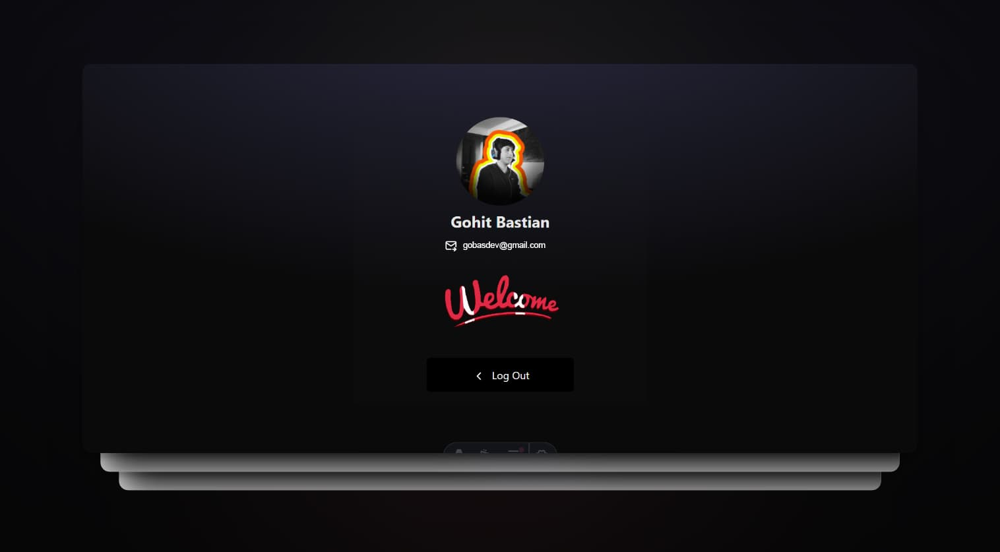

# Astro Auth + Supabase and React 



1. Download the project from `GitHub` and in the terminal type `npm install` 
```
npm install
```

2. create environment Variables `.env` important create private `.env.local` 
```sh
SUPABASE_URL=YOUR_SUPABASE_URL
SUPABASE_ANON_KEY=YOUR_SUPABASE_ANON_KEY
```

3. Create new project in [Supabase](https://supabase.com/dashboard/sign-in?returnTo=%2Fprojects)
> NOTE: replace YOUR_SUPABASE_URL and YOUR_SUPABASE_ANON_KEY in `.env`

4. install supabase in terminal with your project 
```
npm install @supabase/supabase-js
```
4.1. Add this code in `src/env.d.ts`
```sh
interface ImportMetaEnv {
  readonly SUPABASE_URL: string
  readonly SUPABASE_ANON_KEY: string
}

interface ImportMeta {
  readonly env: ImportMetaEnv
}
```

5. Create new folder `/lib` in /src and file `supabase.ts` src/lib/supabase.ts
```sh
import { createClient } from "@supabase/supabase-js";

export const supabase = createClient(
  import.meta.env.SUPABASE_URL,
  import.meta.env.SUPABASE_ANON_KEY,
);
```
6. Create project in [google cloud](https://cloud.google.com/) and [github dev](https://github.com/bastndev)

7. Code - Documentation [Astro.js](https://docs.astro.build/en/guides/backend/supabase/)

8. add this is code in buttons for `login` and `exit`
```
  <form action="/api/auth/login" method="post">

  <form action="/api/auth/logout">
```

> [!IMPORTANT]
> Add or change in: `astro.config.mjs` to (output: 'server',)

9. Integrates `Name` and `Email`, `Picture`
```
const name = data?.user?.user_metadata?.full_name; 
const picture = data?.user?.user_metadata?.avatar_url;
```
<details >
<summary >Code example: </summary>

```
import { Icons } from "../components/Icons";
import { supabase } from "../lib/supabase";

const { cookies, redirect } = Astro;

const accessToken = cookies.get("sb-access-token");
const refreshToken = cookies.get("sb-refresh-token");

if (!accessToken || !refreshToken) {
  return redirect("/login");
}

const { data, error } = await supabase.auth.setSession({
  refresh_token: refreshToken.value,
  access_token: accessToken.value,
});

if (error) {
  cookies.delete("sb-access-token", {
    path: "/",
  });
  cookies.delete("sb-refresh-token", {
    path: "/",
  });

  return redirect("/login");
}

const email = data?.user?.email;
const name = data?.user?.user_metadata?.full_name; 
const picture = data?.user?.user_metadata?.avatar_url;
```
</details>

> [!TIP]
> Change in: `/pages/api/auth/logout.ts` return redirect("/signin"); to `("/")` or `("/login)`

<details >
<summary >Add in: (pages/dashboard.astro) </summary>

```
const { cookies, redirect } = Astro
const accessToken = cookies.get('sb-access-token')
const refreshToken = cookies.get('sb-refresh-token')

if (!accessToken && !refreshToken) {
  return redirect('/login')
}
```
</details>

<details >
<summary >Add in: (pages/login.astro) </summary>

```
const { cookies, redirect } = Astro

const accessToken = cookies.get('sb-access-token')
const refreshToken = cookies.get('sb-refresh-token')

if (accessToken && refreshToken) {
  return redirect('/dashboard')
}
```
</details>


## Technology Used

| Technology  | Purpose               | Link                                                 |
|-------------|-----------------------|------------------------------------------------------|
| Astro       | Astro Doc Supabase    | [Docs](https://docs.astro.build/en/getting-started/) |
| TailwindCSS | Styling               | [Docs](https://tailwindcss.com/)                     |
| React       | Library               | [Docs](https://react.dev/)                           |
| Supabase    | Database/storage/auth | [Docs](https://supabase.com/)                        |
| Google      | Google cloud          | [Docs](https://cloud.google.com/)                    |
| GitHub      | Github Dev            | [Docs](https://github.com/bastndev)                  |

[X/Twitter](https://twitter.com/bastndev) - [Linkedin](https://www.linkedin.com/in/bastndev/)
